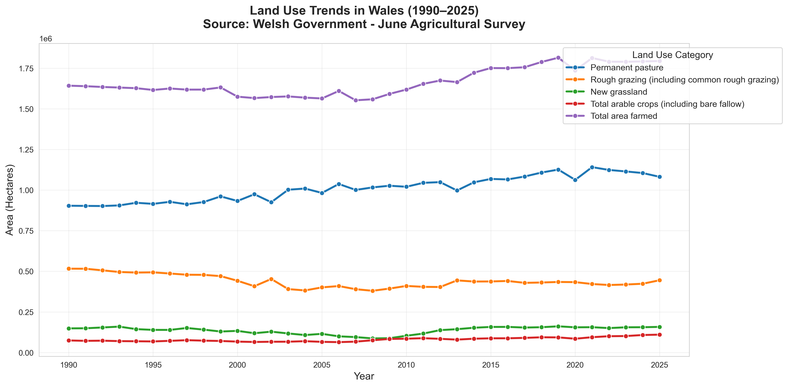
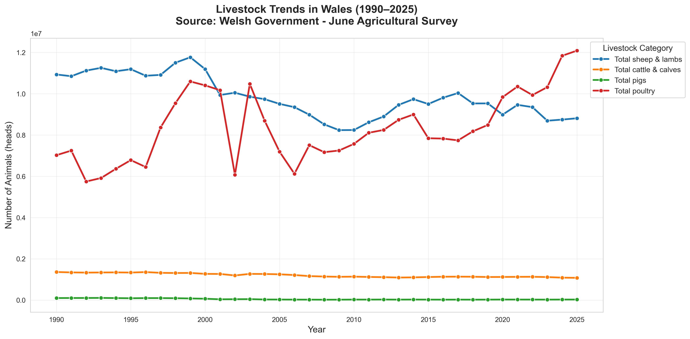
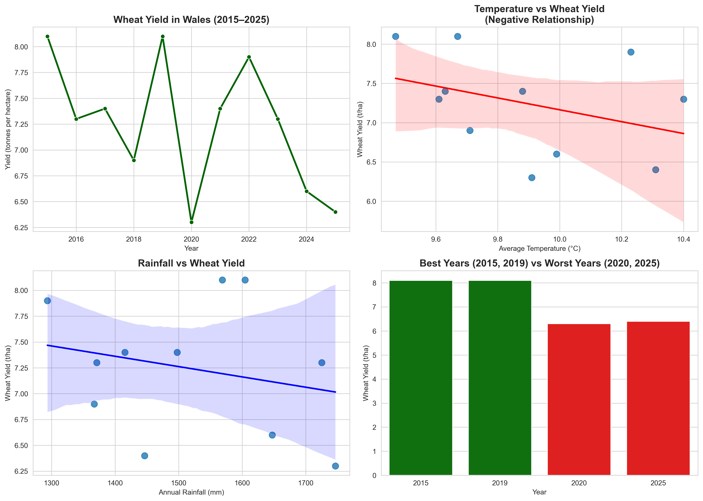

# Welsh Agriculture Data Analysis Portfolio

## About This Repository

This repository contains two data analysis projects focused on agriculture in Wales. Both projects use real government data to explore trends, identify patterns, and generate actionable insights relevant to farming, agribusiness, and agricultural technology.

## Projects

### 1. Agricultural Trends in Wales (1990–2025)

**Focus:** Long-term analysis of livestock numbers and land use changes in Wales.

**Key Highlights:**
- Analyzed 35 years of data from the Welsh Government June Agricultural Survey.
- Identified major structural shifts in Welsh agriculture (strong growth in poultry, decline in sheep, cattle, and pigs).
- Produced professional visualizations and trend analysis.

**Technologies:** Python (pandas, seaborn, matplotlib), Jupyter Notebook  
**Main File:** `Wales_Agriculture_Analysis.ipynb`

---

### 2. Wheat Yield and Weather Impact Analysis in Wales (2015–2025)

**Focus:** Examines how temperature, rainfall, and sunshine affect wheat yield in Wales.

**Key Highlights:**
- Wheat yield in Wales **declined by 21%** between 2015 and 2025.
- Found a **moderate negative correlation** between temperature and wheat yield.
- Identified that excessive rainfall (e.g. 2020) and very high temperatures were associated with lower yields.
- Moderate weather conditions performed best for wheat production.

**Technologies:** Python (pandas, seaborn, matplotlib), Jupyter Notebook  
**Main File:** `Wheat_Yield_Weather.ipynb`

---

## Skills Demonstrated

- Data cleaning and preparation from government sources
- Exploratory data analysis and statistical interpretation
- Data visualization and storytelling
- Correlation analysis and trend identification
- Generating business-relevant insights and recommendations

## Tools Used

- Python
- pandas
- seaborn & matplotlib
- Jupyter Notebook

---

**Author:** [Cristina Homrich]   
**Email:** [cristinahomrich.uk@gmail.com]
